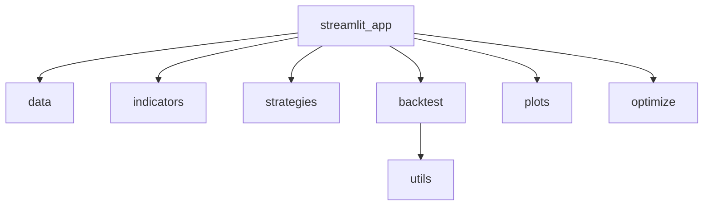

# QuantBoard Architecture



## Modules
- **data.py**: descarga precios de `yfinance` con caching opcional y retorna `DataFrame` limpio.
- **indicators.py**: implementa indicadores técnicos (SMA, EMA, RSI, MACD, Bollinger).
- **strategies.py**: genera señales de trading a partir de indicadores (SMA crossover, RSI thresholds, Bollinger mean reversion, Donchian breakout).
- **backtest.py**: ejecuta backtests simples y calcula métricas (CAGR, Sharpe, Max Drawdown).
- **plots.py**: crea gráficos Plotly (OHLC con overlays, heatmaps).
- **optimize.py**: búsqueda de parámetros (grid search) para SMA.
- **utils.py**: utilidades matemáticas como `compute_cagr`, `compute_sharpe`, `max_drawdown` y constantes de calendario.
- **streamlit_app.py**: interfaz de usuario que coordina la descarga de datos, generación de indicadores y señales, ejecución de backtest y gráficos.

## Proposed final folder tree
```text
quantboard/
├── app/
│   └── streamlit_app.py
├── data/
│   ├── __init__.py
│   └── price.py
├── indicators/
│   ├── __init__.py
│   ├── moving_average.py
│   ├── momentum.py
│   └── volatility.py
├── strategies/
│   ├── __init__.py
│   ├── trend.py
│   ├── mean_reversion.py
│   └── breakout.py
├── backtest/
│   ├── __init__.py
│   ├── core.py
│   └── metrics.py
├── optimize/
│   ├── __init__.py
│   └── grid.py
├── plots/
│   ├── __init__.py
│   ├── price.py
│   └── heatmap.py
├── utils/
│   ├── __init__.py
│   └── math.py
└── tests/
    └── test_example.py
```
